```mermaid
graph TD
    A[Plataforma Unificada] --> B(Módulos Principais)

    %% MÓDULO DO RH (RAFAELA)
    subgraph RH_DASHBOARD [Dashboard do RH - GESTÃO]
        B --> C(1. DASHBOARD)
        B --> D(2. R&S)
        B --> E(3. ADMISSÃO & DP)
        B --> F(4. ONBOARDING & TREINAMENTO)
        B --> G(5. RELATÓRIOS)
        B --> H(6. CONFIGS)

        %% Detalhamento das Telas do RH
        C --> C1(Visão Geral e Alertas)
        D --> D1(Vagas/Status)
        D --> D2(Criação de Vaga: Acessibilidade)
        D --> D3(Análise: IA, Rankeamento)
        D --> D4(Seleção: Automação R&S -> Admissão)

        E --> E1(Gestão de Admissões)
        E --> E2(Documentação/Formulários)
        E --> E3(Validação Automática de Docs - CHAVE)
        E --> E4(Contrato e Assinatura)
        E --> E5(Logística: Aviso a Gestores/Compras)

        F --> F1(Gestão de Trilhas)
        F --> F2(Biblioteca de Conteúdo)
        F --> F3(Encaminhamento Personalizado)

        G --> G1(Relatórios de Eficiência)
        G --> G2(Relatórios Estratégicos)
        G --> G3(Métricas de Engajamento)

        H --> H1(Configurações de Perfil)
        H --> H2(Administração de Usuários)
        H --> H3(Integrações: Contabilidade)
        
        %% Fluxo de automação crítica
        D4 -- Migração de Dados --> E1
    end

    %% MÓDULO DO COLABORADOR (ANA CLARA)
    subgraph COLABORADOR_PORTAL [Portal do Colaborador - EXPERIÊNCIA]
        B --> I(7. PORTAL EXTERNO)

        I --> J(PÁGINA INICIAL)
        I --> K(ADMISSÃO)
        I --> L(ONBOARDING)
        I --> M(RECURSOS RÁPIDOS)
        I --> N(PERFIL)

        %% Detalhamento das Telas do Colaborador
        J --> J1(Status Geral do Processo)

        K --> K1(Checklist Visual/Guiado - CHAVE)
        K --> K2(Upload de Documentos)
        K --> K3(Contrato para Assinatura)

        L --> L1(Minhas Trilhas de Aprendizagem)
        L --> L2(Calendário de Integração)
        L --> L3(Página da Cultura)

        M --> M1(Gerenciador de Logins - CHAVE)
        M --> M2(FAQ/Guia de Benefícios)

        N --> N1(Ajustes de Acessibilidade)
        
        %% Fluxo de dados crítico
        E2 -. Recebe Formulário .-> K2
        F1 -. Entrega Conteúdo .-> L1
    end
```

<h1 align="left">Oie 👋! Meu nome é Laís Reis.</h1>

###

 

  
  
  

###

 

Sou formada em Ciência da Computação e finalizei recentemente minha pós em Design Digital. Gosto de unir o lado técnico com o lado criativo do design — criar interfaces bonitas, mas também funcionais e acessíveis.

###

<h3 align="left">Status e Tecnologias</h3>

###

  
  

###

  
  
  
  
  
  
  
  
  
  
  

###

<h4 align="left">Estou estudando</h4>

###

  

###

###
